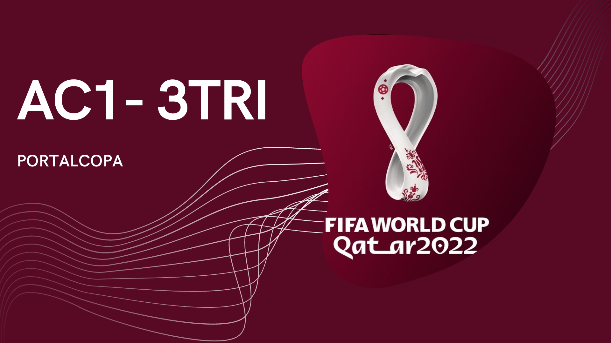
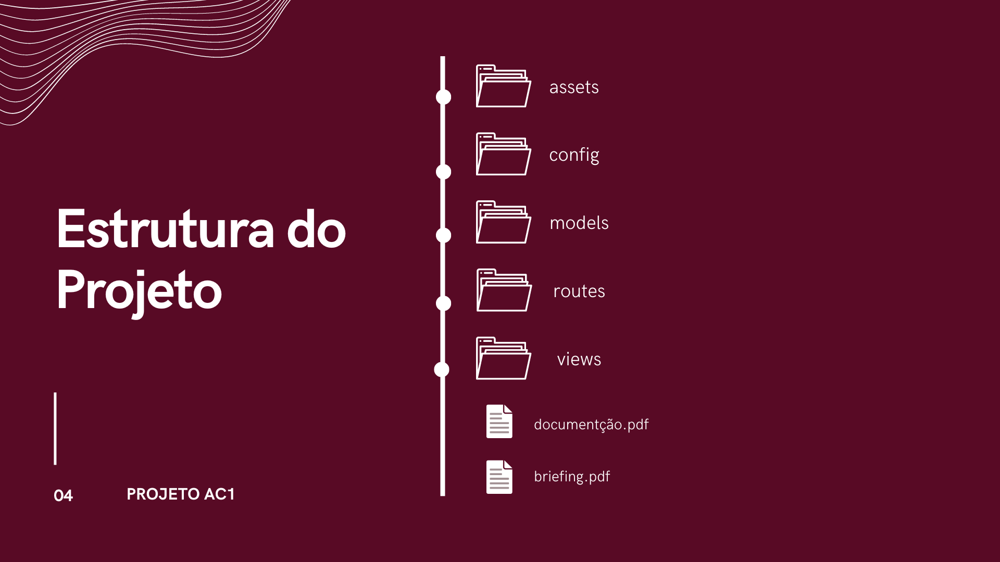

<p>
<a href="http://jigsaw.w3.org/css-validator/check/referer">
    
    </a>
</p>



### 👥 Autores
- Ana Luiza Cavalcante de Menezes rm:13922 
- `Juliana Barbosa Sandes rm:12350` 
- Thiago Baptista da Silva Soares rm:12264

# ⚽ AC1-3TRI | PORTAL COPA 

* **Nosso site:** <br>
O site é do tipo informativo. Ajudaremos com curiosidades sobre o país sede, como, lugares para refeição, hospedagem e diversão. Também mostraremos atletas que participarão da competição. 

* **Objetivos:** <br>
Aconselhar pessoas que estão curiosas, ou, estão se preparando para sua viagem ao Catar (Copa do Mundo de 2022).

* **Conteúdo:** <br>
As informações sobre os resultados dos jogos, conforme o passar das partidas e de seus resultados, quem vence e perde, quem avança e quem está fora da competição. 

## 💼 Briefing
Clique aqui para acessar **toda a visualização do Briefing** de nosso projeto: [Briefing](https://github.com/JulianaSandes/AC1-3TRI/blob/main/docs/Briefing.pdf). 👈

## 🎨 Wireframe
Clique aqui para acessar **toda a visualização do Wireframe** de nosso projeto: [Wireframe](https://www.figma.com/file/iiiPdkHZGVoZlA7KTHlAC7/AC-3%C2%B0TRI?node-id=0%3A1). 👈

<p align="center">
 

## 📂 Planejamento - Banco de Dados
Clique aqui para acessar **toda a visualização do Planejamento - Banco de Dados** de nosso projeto: [Planejamento - Banco de Dados](https://github.com/JulianaSandes/AC1-3TRI/blob/main/docs/PlanejamentoDB.pdf). 👈

## 📃 Documentação

Clique aqui para acessar **toda a visualização da Documentação** de nosso projeto: [Documentação](https://www.canva.com/design/DAFMHKiSZ-Q/0dAA72BJhXmgBNG0WO7_4A/view?utm_content=DAFMHKiSZ-Q&utm_campaign=designshare&utm_medium=link2&utm_source=sharebutton). 👈 <br>
(Documentação em andamento, possíveis mudanças podem ocorrer conforme o desenvolvimento do projeto)


    
_________

## 📦 Instalação

Clone ou faça o downlod deste repositório:

```
# Clone o repositório
$ git clone https://github.com/JulianaSandes/AC1-3TRI
```

Instale as dependências do projeto:

```
# Instale as dependencias
$ npm install
# Rode 
$ npm start
```
