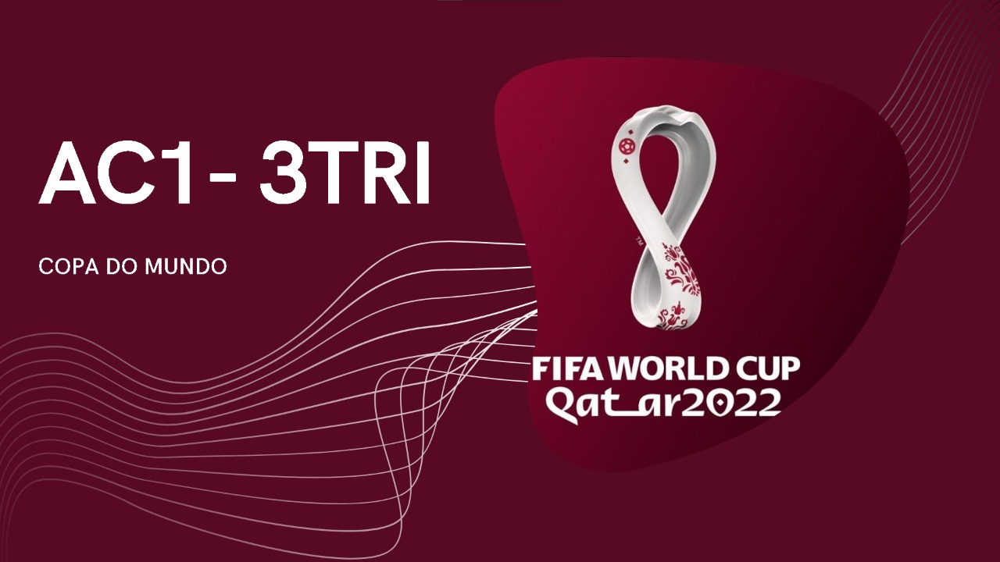
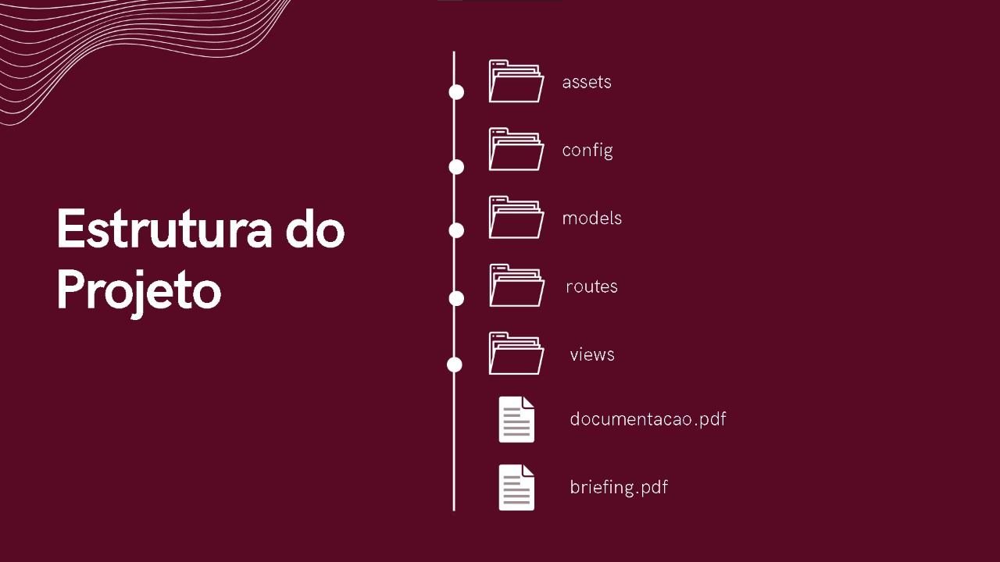

 
  

# ⚽ AC1-3TRI

* **Nosso site:**  
O site é do tipo informativo. Ajudaremos com curiosidades sobre o país sede, como, lugares para refeição, hospedagem e diversão. Também mostraremos atletas que participarão da competição. 

* **Objetivos:**  
Aconselhar pessoas que estão curiosas, ou, estão se preparando para sua viagem ao Catar (Copa do Mundo de 2022).

* **Conteúdo:**  
As informações sobre os resultados dos jogos, conforme o passar das partidas e de seus resultados, quem vence e perde, quem avança e quem está fora da competição. 

## 💼 Briefing
Clique aqui para acessar **toda a visualização do Briefing** de nosso projeto: [Briefing](https://github.com/JulianaSandes/AC1-3TRI/blob/main/Briefing.pdf). 👈

## 📃 Documentação

Clique aqui para acessar **toda a visualização da Documentação** de nosso projeto: [Documentação](https://www.canva.com/design/DAFMHKiSZ-Q/0dAA72BJhXmgBNG0WO7_4A/view?utm_content=DAFMHKiSZ-Q&utm_campaign=designshare&utm_medium=link2&utm_source=sharebutton). 👈

## 👥 Autores
- Ana Luiza Cavalcante de Menezes rm:13922 
- Felipe Chiozzotto rm:12030
- `Juliana Barbosa Sandes rm:12350` 
- Kawuan Americo Mizael da Silva rm:14695
- Tarik Omar Mazloum rm:14661
- Thiago Baptista da Silva Soares rm:12264
